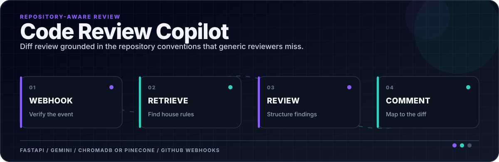
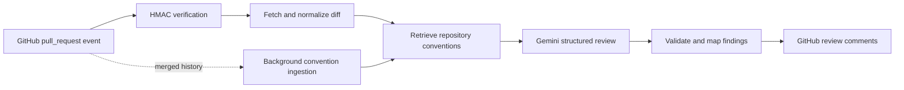

<div align="center">



</div>

[](./requirements.txt)
[](./app)
[](./tests)
[](./Dockerfile)

**A webhook-driven review service that combines the current diff with repository-specific conventions before it comments.**

The service receives GitHub pull-request events, verifies the webhook signature, retrieves relevant house rules and merged-PR history, asks Gemini for structured findings, and maps accepted findings back to review comments. Development uses ChromaDB; production can switch to Pinecone without changing the review flow.

## What is implemented

| Capability | Implementation |
|---|---|
| Webhook intake | FastAPI endpoint with HMAC signature verification |
| Review context | Pull-request diff plus repository-scoped retrieved conventions |
| Retrieval | ChromaDB locally; Pinecone adapter for production |
| Embeddings | Gemini embeddings with a reduced 1,024-dimensional representation |
| History learning | Background ingestion of recent merged pull requests |
| Isolation | Vector namespaces are scoped by `owner/repository` |
| Verification | `unittest` coverage for webhook, review, signature, and diff-parser paths |

## Runtime path



## Quickstart

Prerequisites: Docker, Docker Compose, a GitHub token with the repository permissions this integration needs, and a Gemini API key. Pinecone is optional.

```bash
cp .env.example .env
```

Set the real values locally:

```env
GITHUB_TOKEN=your_github_token
GEMINI_API_KEY=your_gemini_key
WEBHOOK_SECRET=your_secure_random_string

# Optional production vector store
ENVIRONMENT=development
PINECONE_API_KEY=your_pinecone_key
```

```bash
docker-compose up --build -d
```

Open the API documentation at [http://localhost:8000/docs](http://localhost:8000/docs).

## Verify

The focused tests do not require live GitHub or model credentials:

```bash
python -m unittest discover -s tests
```

## Connect a GitHub repository

Create a webhook in the repository settings with:

- **Payload URL:** `https://<public-api-origin>/webhook/github`
- **Content type:** `application/json`
- **Secret:** the same value as `WEBHOOK_SECRET`
- **Event:** Pull requests

The `opened` and `synchronize` paths trigger review orchestration and enqueue history learning without blocking the webhook response.

## Teach an explicit convention

Use the Swagger UI or call the repository-scoped learning endpoint:

```bash
curl -X POST "http://localhost:8000/conventions/learn" \
  -H "Content-Type: application/json" \
  -d '{
    "rule": "Replace print statements with structured logging",
    "repo_name": "owner/repository"
  }'
```

## Security boundary

- Reject webhook requests that do not pass HMAC-SHA256 verification.
- Keep GitHub, Gemini, and Pinecone credentials out of commits and logs.
- Scope retrieval data per repository to prevent cross-project convention leakage.
- Treat model output as a proposed review: validate paths, lines, and severity before posting.

## Repository map

```text
app/                 API, integrations, retrieval, and review orchestration
tests/               focused automated verification
.env.example         required configuration contract
docker-compose.yml   local service topology
Dockerfile           reproducible API image
```
